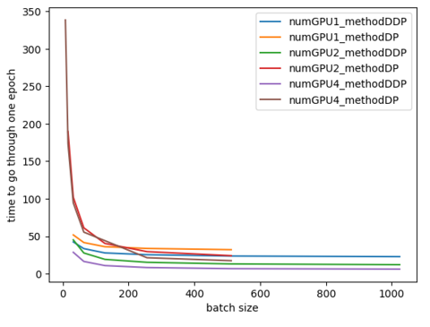

# Test_GPU_Tarallel
## Experiment Setting
## Running the code
For DataParallel(DP)
```bash
python DP.py --num_GPU {number of GPU} --batch_size {number of batch size} --type_GPU {GPU name}

e.g. 
python DP.py --num_GPU 1 --batch_size 32 --type_GPU a40
```

For DistributedDataParallel(DDP)
```bash
python -m torch.distributed.launch --nproc_per_node={number of GPU}  DDP.py --num_GPU {number of GPU}  --batch_size {number of batch size}--type_GPU {GPU name}

e.g. 
python -m torch.distributed.launch --nproc_per_node=4 DDP.py --num_GPU 4 --batch_size 1024 --type_GPU a40
```

For torchrun(similar to DistributedDataParallel)
```bash
torchrun --nproc_per_node={number of GPU} DDP_torchrun.py --num_GPU {number of GPU} --batch_size {number of batch size} --type_GPU {GPU name}
```

For pytorch2.0 + torchrun(similar to DistributedDataParallel)
```bash
torchrun --nproc_per_node={number of GPU} DDP_torch20.py --num_GPU {number of GPU} --batch_size {number of batch size} --type_GPU {GPU name}
```

## Results
## DDP_VS_DP
<p align="center">

</p>

Three conclusion from the figure:
<ol>
  <li>When batchsize is small, DDP parallels the GPU while DP doesn't (guess some issue of communication)</li>
  <li>For only one GPU, DDP faster than DP. (mentioned in the official website)</li>
  <li>When batchsize is large, DP does have acceleration for multi-GPU, but worse than DP (4 GPUs use DP worse than 2 GPUs use DDP)</li>
</ol>
